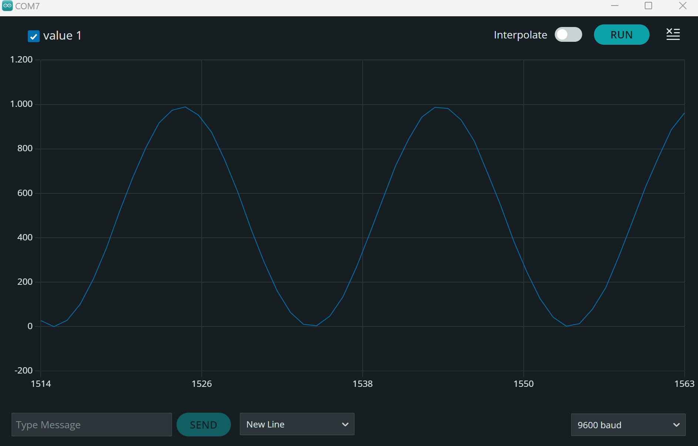

## PWM Measurement using Arduino UNO

This code is an example of measuring a pulse duration on a specific channel using an Arduino board.

### Prerequisites

To run this code, you will need:

- An Arduino board
- Arduino IDE or compatible software
- Connection to a computer

### Setup

1. Connect your Arduino board to your computer.
2. Open the Arduino IDE (or compatible software).
3. Create a new sketch and paste the code into the sketch.
4. Upload the sketch to the Arduino board.
5. Open the serial monitor in the Arduino IDE (or compatible software) to view the measured pulse duration.

### Circuit Diagram

Make sure to connect the input device (e.g., a sensor or signal source) to pin 2 of the Arduino board.

### Code Explanation

1. The `setup()` function is called once when the Arduino board is powered on or reset. It sets the pin 2 as an input and initializes the serial communication.
2. Measures the pulse duration on pin 2 when it is LOW using `pulseIn()` function and stores it in the `channel` variable.
3. Prints the `channel` value to the serial monitor using `Serial.println()` function.
4. Adds a delay of 100 milliseconds using `delay()` function to halt for a specific duration of time.

### Usage

After uploading the code to the Arduino board and opening the serial monitor, you will see the measured pulse duration displayed in the serial monitor:

